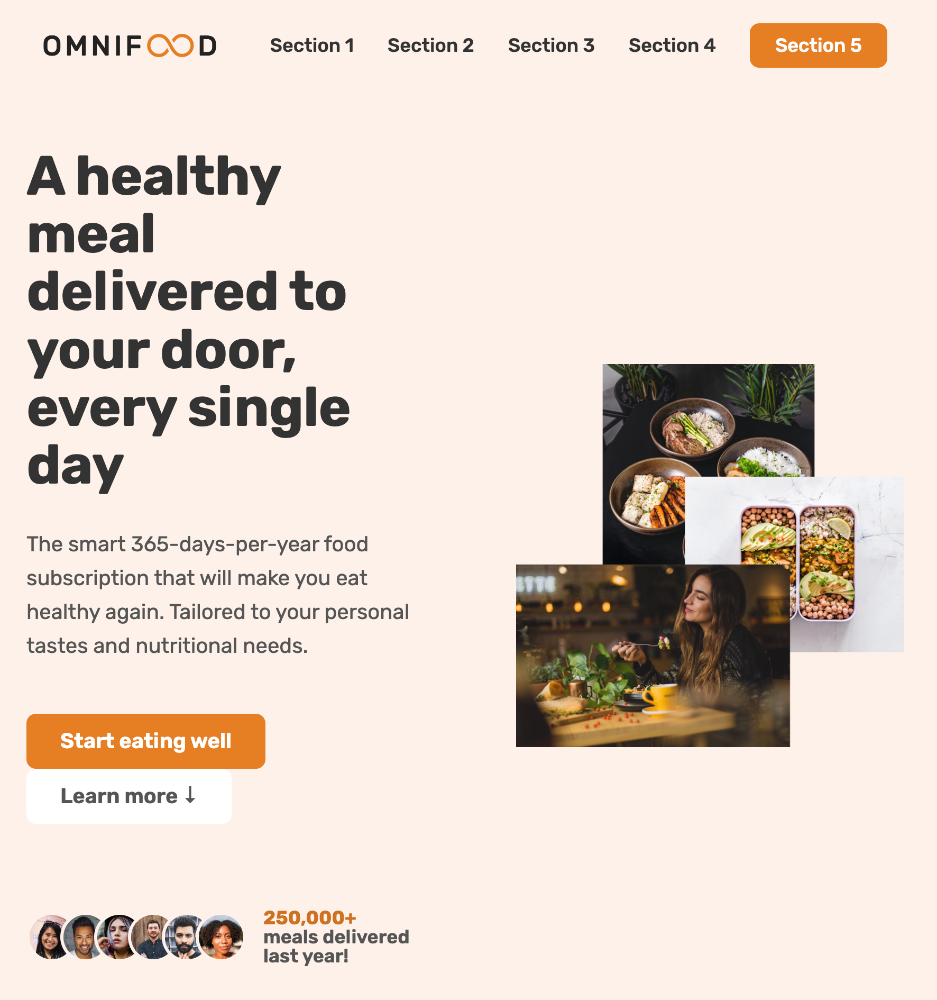

# Omnifood project

  

## Description

Example of moderm web design with HTML5, CSS3 and JavaScript.

> This is from the '[Build Responsive Real-World Websites with HTML and CSS](https://www.udemy.com/course/design-and-develop-a-killer-website-with-html5-and-css3/)' Udemy course by Jonas Schmedtmann. 

SECTIONS:

* Logo + Navigation
* Hero
* Feature In
* How it works
* Meals (and list of diets)
* Testimonials + gallery
* Pricing + features
* CTA
* Footer

## Home Page

## Stack

* [HTML5](https://developer.mozilla.org/en-US/docs/Glossary/HTML5)
  * \<header> - \<main> - \<section> - \<footer>
  * \<nav> - \<figure> - \<aside>
  * \<picture> - \<source>
  * \<address>
* [CSS3](https://developer.mozilla.org/en-US/docs/Web/CSS)
  * Pseudo-classes: Hover, Link, Active, Visited, Last-child, Not
  * Psuedo-elements: after, before
  * Display: Absolute, Flex and Grid
  * Filter and Opacity
  * Transform
  * Transition
  * Box-shadow and Overflow
  * @media queries
  * Mobile navigation button
* [Javascript](https://developer.mozilla.org/en-US/docs/Web/JavaScript)
  * [Smoothscroll-polyfill](https://unpkg.com/browse/smoothscroll-polyfill@0.4.4/)
    > To make it works on Safary and iPhones
  * Sticky navigation

## References

* [HTML elements reference](https://developer.mozilla.org/en-US/docs/Web/HTML/Element)
* [CSS reference](https://developer.mozilla.org/en-US/docs/Web/CSS/Reference)
* [Build Responsive Real-World Websites with HTML and CSS](https://www.udemy.com/course/design-and-develop-a-killer-website-with-html5-and-css3/)
* [Google Fonts](https://fonts.google.com)
* [Tint & Shade Generator](https://maketintsandshades.com/)
* [UI Faces](https://www.uifaces.co)
* [Unsplash](https://unsplash.com/)
* [Ionic](https://ionic.io/ionicons)
* [Open color](https://yeun.github.io/open-color/)